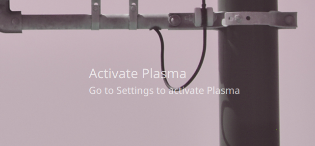

Activate Plasma
===============

Oh you thought your Linux desktop is free?
Your KDE Plasma installation is not activated, go to Settings to activate it.



Inspired by [https://github.com/isjerryxiao/gnome-shell-extension-activate-gnome](https://github.com/isjerryxiao/gnome-shell-extension-activate-gnome)

Installation
------------

Directly from GitHub:

```bash
git clone https://github.com/RedL0tus/Activate-Plasma activate-plasma
cd activate-plasma
kpackagetool5 -t Plasma/Applet --install fish.salted.activate-plasma
```
